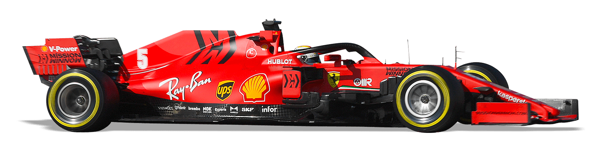

<div align="center">

# Computational Simulation of Energy Loss in a Formula One Circuit

##### MATLAB simulation of an F1 car navigating through a curved track. Applies numeric methods and principles of energy conservation.




</div>

## Overview

This project involves the development of a MATLAB simulation showcasing the practical application of fundamental principles of energy conservation for system analysis. Initially, a track curve for a Formula 1 circuit was designed using Lagrange polynomial interpolation. The resulting curve is a third-degree polynomial. Additionally, in designing this track segment, consideration was given to an appropriate banking angle to ensure the safety of the drivers. Subsequently, principles related to energy conservation, friction, momentum, and rigid body rotation were employed to create a Graphical User Interface (GUI). The GUI enables users to observe energy changes, trajectory variations, and velocity fluctuations of a F1 car navigating the designed curve zone. For the calculation of dynamic variables such as the car's velocity, the Euler method was utilized. The simulation incorporates a skid condition, allowing visualization of the effects when a car enters the curve zone at a speed exceeding the recommended limit. Furthermore, the simulation facilitates the investigation of energy dissipation through elastic, inelastic, and perfectly inelastic collisions.

## Usage

Follow these steps to get the project up and running on your local machine.

### Prerequisites

Make sure you have the following installed on your machine:

- [Git](https://git-scm.com/)
- [MATLAB](https://matlab.mathworks.com/)

### Installation

- Clone the repository:

    ```bash
    git clone https://github.com/HumbertoBM2/Computational-Simulation-of-Energy-Loss-in-a-Formula-One-Circuit
    ```

- Open the cloned repository using MATLAB. Run the simulation and enjoy. 